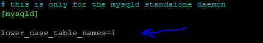

# Projeto exemplo de cadastro de tarefas

### Usando filtro de autorizações
O projeto usa:

* Tabela de autorizações e usuários
* REGEX para ter controle sobre o endpoint a ser autorizado
* Usuário em sessão com suas respectivas autorizações

## Para MariaDB

* Crie da seguinte forma
  * CREATE DATABASE `base` /*!40100 DEFAULT CHARACTER SET utf16 COLLATE utf16_general_ci */;
* Para Linux altere o arquivo 50-server.cnf para permitir case insensitive
  * 
  * 

## Observação

* Foi usado o conceito de herança para JPA com o intuito de definir perfis de usuários. Nesse contexto foi usada a estratégia SINGLE TABLE onde diferentes entidades são incluidas em uma única tabela com um campo designado para distinção.
* Mais dados podem ser obtidos consultando em:
  * https://www.baeldung.com/hibernate-inheritance
  * https://thorben-janssen.com/complete-guide-inheritance-strategies-jpa-hibernate/

## Execução
